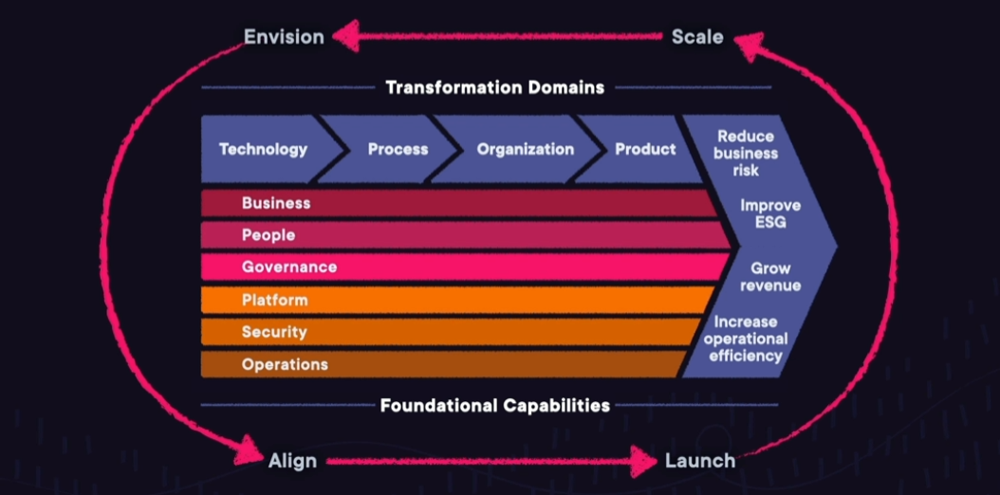

# AWS Practitioner (*CLF-C02*)

**Compute services**: EC2
**Storage services**: S3
**Networking services**: VPC
**Database services**: RDS
**Developer tools**: Code Family
**Migration services**: Migration Hub
**Machine learning services**: Rekognition
**Auditing services**: Trusted Advisor
**Security services**: IAM
**Pricing services**: PRicing Calculator

## CapEx vx. OpEx

**Capital Expenditures**: Capital expenditures are upfront purchases toward fixed assets.
**Operating Expenses**: Operating expenses are funds used to run day-to-day-operations.

## Advantages to Cloud Computing

1. **Go global in minutes**: You can deploy your applications around the world at the click of a button.
1. **No data centers spend**: You can focus on building your applications instead of managing hardware.
1. **Economies of scale**: Volume discounts are passed on to you, which provides lower pay-as-you-go prices.
1. **Speed and agility**: The provided services allow you to innovate more quickly and deliver your applications faster.
1. **Stop guessing capacity**: Your capacity is matched exactly to your demand.
1. **Trade capital expense for variable expense**: You pay for what you use instead of making huge upfront investments.

## Benefits of Cloud Computing

1. **High Availability**: Highly available systems are designed to operate continuously without failure for a long time. These systems avoid loss of service by reducing or managing failures.
1. **Elasticity**: With elasticity, you don't have to plan ahead of time how much capacity you need. You can provision only what you need, and then grow and shrink based on demand.
1. **Agility**: The cloud gives you increased agility. All the services you have access to help you innovate faster, giving you speed to market.
1. **Durability**: Durability is all about long-term data protection. This means your data will remain intact without corruption.

## Cloud Computing Models

1. **Infrastructure as a Service**: EC2, web hosting.
1. **Software as a Service**: Complete application, email provider.
1. **Platform as a Service**: Develop software using web-based tools without worrying about the underlying infrastructure, Cloud9, Storefront website.

## Cloud Deployment Models

1. **Private cloud**: On-premises, exists in your internal data center.
1. **Public cloud**: Offered by AWS, no physical hardware.
1. **Hybrid cloud**: Combination of public and private cloud, Direct connect.

## Availability Zone (AZ)

One or more discrete data centers with redundant power, networking, and connectivity in an AWS Region.

### Characteristics

1. Physical separated
1. Connect through low-latency links
1. Fault tolerant
1. Allows for high availability

## Edge Locations

Mini data center cache content for fast delivery to your users (CloudFront). Edge location uses AWS back bone network, caching data.

## Local Zones

Run applications on AWS infrastructure closer to your end users and workloads. Local zones are extensions of Regions providing millisecond latency for things like real-time gaming.

## Cloud Adoption Framework

Cloud adoption framework focuses on using AWS to digitally transform, and accelerate business outcomes.

### Perspectives and Foundational Capabilities

#### Security

1. Security
   1. Governance
   1. Assurance
   1. Application
1. Protection
   1. Infrastructure
   1. Data
1. Management
   1. Identity and Access
   1. Vulnerability
1. Incident Response
1. Threat Detection

#### Business

1. Management
   1. Strategy
   1. Portfolio
   1. Innovation
   1. Product
1. Data
   1. Data Monetization
   1. Data Science
1. Business Insight

#### Platform

1. Architecture and Engineering
   1. Platform
   1. Data
1. Continuous Integration/Continuous Delivery (CI/CD)
1. Modern Application Development
1. Provisioning and Orchestration

#### Operations

1. Management
   1. Event (AIOps)
   1. Incident and Problem
   1. Change and Release
   1. Performance and Capacity
   1. Configuration
   1. Patch
   1. Availability and Continuity
   1. Application
1. Observability

#### Governance

1. Management
   1. Program and Project Benefits
   1. Risk
   1. CloudFinancial
   1.Application Profile
1. Data
   1. Governance
   1. Curation

#### People

1. Transformation
   1. Leadership
   1. Workforce
1. Organization
   1. Design
   1. Alignment
1. Cloud Fluency
1. Change Acceleration
1. Culture Evolution

### Cloud Transformation Domains

| | |
|-- |-- |
| Technology | Migrate and modernize |
| Process | Digitize, automate, and optimize |
| Organization | Reimagine orchestration |
| Product | Reimagine your business model |

### Cloud Transformation Journey Phases

| | |
|-- |-- |
| Envision | Benefits to business outcomes |
| Align | Gaps across perspectives |
| Launch | Deliver initiatives with value |
| Scale | Expand sustainable initiatives |

## Well-Architected Framework

AWS Well-Architected helps cloud architects build secure, high-performing, resilient, and efficient infrastructure for a variety of applications and workloads. Built around six pillars.

### Operational Excellence

1. Plan for and anticipate failure.
1. Deploy smaller, reversible changes.
1. Script operations as code.
1. Learning from failure and refine.

Use AWS **CodeCommit** for version control to enable tracking of code changes and to version-control **CloudFormation** templates of your infrastructure.

### Security

Focus on protection of data, systems, and any assets used y your workload.

1. Automate security tasks.
1. Encrypt data in transit and at rest.
1. Assign only the least privileges required.
1. Track who did what and when.
1. Ensure security at all applications layers.

Configure central logging of all actions performed in your account using **CloudTrail**.

### Reliability

Focuses on architecting a workload to be consistent and able to recover quickly.

1. Recover from failure automatically.
1. Scale horizontally for resilience.
1. Stop guessing capacity.
1. Manage change through automation.
1. Test recovery procedures.

Use Multi-AZ deployments for enhanced availability and reliability of **RDS** databases.

### Performance Efficiency

Focuses on the ability to use computing resources efficiently to meet requirements.

1. Use serverless architectures first.
1. Use multi-region deployments.
1. Delegate tasks to a cloud vendor.
1. Experiment with virtual resources.

Use AWS **Lambda** to run code with zero administration.

### Cost Optimization

Focuses on the ongoing process of maintaining costs in the cloud.

1. Utilize consumption-based pricing.
1. Implement cloud financial management.
1. Measure overall efficiency.
1. Pay only for resources your application requires.

Use **S3** Intelligent-Tiering to automatically more your data between access tiers based on your usage patterns.

### Sustainability

Focuses on environmental impacts like energy efficiency and consumption.

1. Understand your impact.
1. Establish sustainability goals.
1. Maximize utilization.
1. Use Managed services.
1. Reduce downstream impact.

User **EC2** auto scaling to ensure you are maximizing utilization.

---

Goto [Main Content](../README.md)