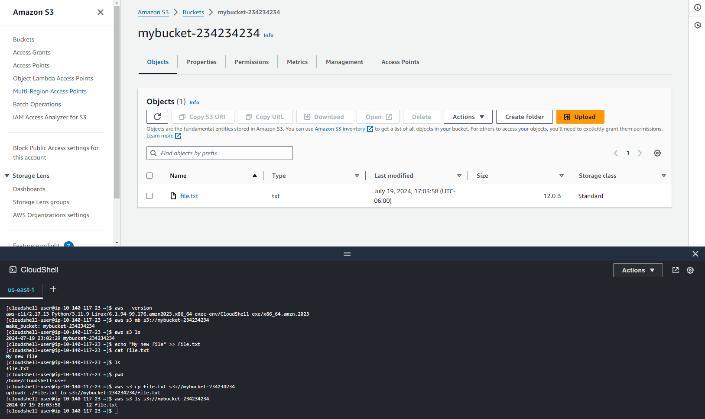

# Development, Messaging, and Technology and Services

## What is Continuous Integration/Continuous Deployment (CI/CD)

1. A widely accepted software development best practice.
1. Automate everything, e.g. code integration, build, test and deployment.
1. Makes changes easy. Apply multiple small changes each day.

### Benefits

1. **Automation is Good**: fast repeatable, scalable.
1. **Manual Effort Avoided**: slow, error prone, inconsistent.
1. **Small Changes Applied Frequently**: catch bugs while they are small, and simple to fix.

### Continuous Deployment Workflow

1. **Merge**: after successful tests, code is merged with the master repository.
1. **Prepare**: code is built, tested and packaged for deployment.
1. **Deploy**: automatically deploy the code as soon as it is ready.

## CodeCommit 

**AWS** **CodeCommit** is a fully-managed source control service that hosts secure Git-based repositories. It makes it easy for teams to collaborate on code in a secure and highly scalable ecosystem.

1. Create repositories to store code. 
1. Commit, branch, and merge code. 
1. Collaborate with other software developers. 

**CodeCommit** is similar to Github. 

## CodeBuild 

Allows to build and test application source code. Fully managed build and test service.

1. Compiles source code and runs tests. 
1. Enables continuous integration and delivery. 
1. Produces build artifacts ready to be deployed. 

Run tests before deploying a new version of an application to production. Allows you to run as many parallel streams of tests as needed, allowing you to deploy your changes to production more quickly. 
 
## CodeDeploy 

**CodeDeploy** manages the deployment of code to compute services in the cloud or on-premises. Automated deployment service.

1. Deploys code to EC2, Fargate, Lambda, and on-premises. 
1. Maintains application uptime. 

Maintain application uptime when rolling out a new version. Rolling deployments. 
 
## CodePipeline 

**CodePipeline** automates the software release process. Automated CI/CD pipeline.

1. Quickly deliver new features and updates. 
1. Integrates with **CodeCommit** to retrieve source code. 
1. Integrates with **CodeBuild** to run builds and unit tests. 
1. Integrates with **CodeDeploy** to deploy your changes. 

DevOps process. CI/CD. 

CodeCommit -> CodeBuild -> CodeDeploy -> EC2

## AWS CloudShell

A browser-based shell that you can use to manage AWS services using the AWS Command Line Interface (AWS CLI) and a range of pre-installed development tools



```bash
$ aws s3 mb s3://mybucket-234234234
make_bucket: mybucket-234234234
$ aws s3 ls
2024-07-19 23:02:29 mybucket-234234234
$ echo "My new file" >> file.txt
$ aws s3 cp file.txt s3://mybucket-234234234
upload: ./file.txt to s3://mybucket-234234234/file.txt            
$ aws s3 ls s3://mybucket-234234234
2024-07-19 23:03:58         12 file.txt
```

## Cloud9

Allows you to write code within an integrated development environment from within your web browser.

1. Integrated development environment (IDE). 
1. Write and debug code. 
1. Supports popular programming languages: JavaScript, Python, Ruby, and C++, and lets you run AWS CLI commands.

**Cloud9** pre-configures the development environment with the needed SDKs and libraries. Easily write code for Lambda function directly in the web browser. 

## AWS CodeArtifact

**AWS CodeArtifact** allows you to store artifacts using popular package managers and build tools like Maven, Gradle, npm, Yarn, Twine, pip, NuGet, and SwiftPM. CodeArtifact can automatically fetch software packages on demand from public package repositories so you can access the latest versions of application dependencies.

Make it easy for developers to find the software packages they need. Includes open-source and in-house developed software.

### Artifact 

Artifact offers on-demand access to AWS security and compliance reports. It can be documentation, complied applications, deployable packages, and libraries.

1. Central repository for compliance reports from third-party auditors. 
1. Service Organization Controls (SOC) reports. 
1. Payment Card Industry (PCI) reports. 

Artifact provides a central repository for AWS' security and compliance reports via a self-service portal. 

## Decoupling Application Components

Coupling describes the dependencies between the components of an application. 

### Tight Coupling

This is usually a feature of monolithic applications where all the components of an application are interdependent.

1. With tightly coupled systems, there are lots of dependencies between the components.
1. Problems can then occur if one part of the system is slower or faster than another.
1. One failed component can bring the whole system down.

### Loose Coupling

Typically see with microservices-based architectures, this is where the components of the application can operate independently.

1. Components operate independently.
1. One component doesn't need to wait until another component has completed its work before moving on to the next tasks.
1. Data and messages are moved between components of the application.

### Integration Approach

Decoupling.

1. Queues - Simple Queue Service (SQS)
1. Notifications - Simple Notification Service (SNS)
1. Events - EventBridge

## Simple Notification Services

SNS allows you to send email and text message from your applications. 

1. Set up, operate, and send notifications.
1. SMS text message or email.
1. Messages sent from an application can be immediately delivered to subscribers or other applications.

### Publish and Subscribe model

1. Applications publish or push messages to a topic.
1. Subscribers receive message from a topic.

Topic is simple an access point.

## Simple Queue Service

1. **Simple Queue Service** enables web applications to quickly and reliable queue messages that one component in the application produces, for another component to consume.
1. A ***queue*** is a temporary repository for message awaiting processing.
1. Messages wait in the queue until the consumer is ready to process them.
1. No component gets overloaded by too many requests.
1. The system won't crash if a component goes offline.

### Key Features

1. Decoupling.
1. SQS is pull-based.
1. Multiple components can add and consume messages.
1. Messages are processed asynchronously.
1. Guaranteed to be processed at least once.

### SQS STandard Queues

1. Guarantee that a message is delivered at least once.
1. Best-effort ordering means that messages are generally delivered in the same order as they are sent.
1. Occasionally more than one copy of a message might be delivered out of order.

### SQS FIFO Queues

1. First-in-first-out ordering.
1. The order in which messages are sent and received is strictly preserved.
1. Exactly once processing means duplicates are not introduced.

## Shorting Polling vs Long Polling

### Short Polling

1. Returns a response immediately even if the message queue being polled is empty.
1. Still pay for the responses even though they are empty.

### Long Polling

1. Periodically polls the queue
1. The queue doesn't respond until a message arrives, or the long poll times out.
1. Fewer empty responses and saves money.

## Simple Email Service (SES)

1. Cloud-based email service
1. Enable your application to send richly formatted HTML emails.
   1. Send emails in bulk.
   1. Track open or click-through rates.
   1. Understand the effectiveness of your campaign.
1. Confirmation of an order or delivery.
1. Marketing campaign with details of new launches, special offers, and discounts.

## Amazon EventBridge

**EventBridge** is all about event-driven architecture.

An ***event*** is a change in state generated by services like **EC2**, **CloudWatch**, **CloudTrail**.

1. Allow you to easily configure event-driven systems.
1. Define tasks that can be run on a pre-defined schedule.

## Step Functions

**Step Functions** are visual workflow services that helps developers use AWS services to build distributed applications, automate processes, orchestrate microservices, and create data and machine learning (ML) pipelines.

1. Visual interface of serverless applications.
1. Build, and run serverless applications as a series of steps.
1. Each step in your application executes in order, as defined by your business logic.
1. The output of one step may act as an input to the next.

**Step Functions** can be used to handle processes that have parallel steps.

## Deploying Infrastructure as Code with AWS CloudFormation

**Infrastructure as code** (**IaC**) is the ability to provision and support your computing infrastructure using code instead of manual processes and settings.

**CloudFormation** manages, configures, and provision your AWS infrastructure as code. Resources defined in a **CloudFormation** ***template*** written in `YAML` or `JSON`.

### Benefits

1. <u>Consistent</u>: infrastructure is provisioned consistently, with fewer mistakes.
1. <u>Quick and Efficient</u>: Less time and effort than configuring things manually.
1. <u>Free to Use</u>: You are only charged for the AWS resources you create sing CloudFormation.

## AWS Elastic Beanstalk

**Elastic Beanstalk** is a service for deploying and scaling web applications and services. Upload your code and automatically handles the deployment—from capacity provisioning, load balancing, and auto scaling to application health monitoring.

Provision the AWS resources: **EC2**, **RDS**, **S3**, **Elastic Load Balancers**, **Auto Scaling Groups**, etc.

Support `Java`. `.NET`, `PHP`, `Node.js`, `Python`, `Ruby`, `Go`, `Apache Tomcat`, `IIS`, `NGiNX`, `Docker`.

1. No need to worry about configuring the underlying infrastructure needed to run the application.
1. Get your application to market faster.
1. Fastest and simplest way to deploy your application in AWS.
1. Handles patching and updates.

### Scenario

1. Create a service role for **Elastic Beanstalk**.
1. Create an **EC2** instance role for **Elastic Beanstalk**.
1. Upload the provided code.

[Github Repo for Deploying an application using **Elastic Beanstalk**](https://github.com/pluralsight-cloud/AWS-Certified-Cloud-Practitioner-CCP-CLF-C02/tree/main/Deploying_An_App_With_Elastic_Beanstalk_Demo/Deploying_An_App_With_Elastic_Beanstalk_Demo)


## X-Ray

1. A tool which helps developers analyze and debug distributed applications.
1. Allowing you to troubleshoot the root cause of performance issues and errors.
1. Provide a visualization of your application's underlying components.

---

[[Back to Table of Content](README.md)]