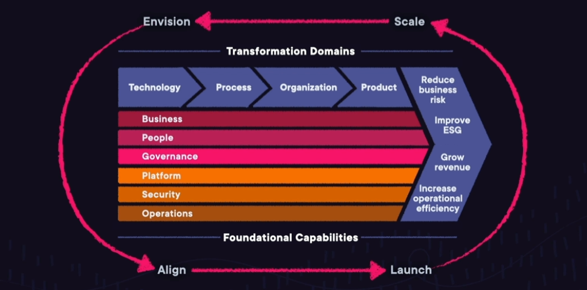

# Foundations of Cloud Computing

## CapEx vx. OpEx

**Capital Expenditures**: Capital expenditures are upfront purchases toward fixed assets.
**Operating Expenses**: Operating expenses are funds used to run day-to-day-operations.

## Advantages to Cloud Computing

1. **Go global in minutes**: You can deploy your applications around the world at the click of a button.
1. **No data centers spend**: You can focus on building your applications instead of managing hardware.
1. **Economies of scale**: Volume discounts are passed on to you, which provides lower pay-as-you-go prices.
1. **Speed and agility**: The provided services allow you to innovate more quickly and deliver your applications faster.
1. **Stop guessing capacity**: Your capacity is matched exactly to your demand.
1. **Trade capital expense for variable expense**: You pay for what you use instead of making huge upfront investments.

## Benefits of Cloud Computing

1. **High Availability**: Highly available systems are designed to operate continuously without failure for a long time. These systems avoid loss of service by reducing or managing failures.
1. **Elasticity**: With elasticity, you don't have to plan ahead of time how much capacity you need. You can provision only what you need, and then grow and shrink based on demand.
1. **Agility**: The cloud gives you increased agility. All the services you have access to help you innovate faster, giving you speed to market.
1. **Durability**: Durability is all about long-term data protection. This means your data will remain intact without corruption.

## Cloud Computing Models

1. **Infrastructure as a Service**: EC2, web hosting.
1. **Software as a Service**: Complete application, email provider.
1. **Platform as a Service**: Develop software using web-based tools without worrying about the underlying infrastructure, Cloud9, Storefront website.

## Cloud Deployment Models

1. **Private cloud**: On-premises, exists in your internal data center.
1. **Public cloud**: Offered by AWS, no physical hardware.
1. **Hybrid cloud**: Combination of public and private cloud, Direct connect.

## Availability Zone (AZ)

One or more discrete data centers with redundant power, networking, and connectivity in an AWS Region.

### Characteristics

1. Physical separated
1. Connect through low-latency links
1. Fault tolerant
1. Allows for high availability

## Edge Locations

Mini data center cache content for fast delivery to your users (CloudFront). Edge location uses AWS back bone network, caching data.

## Local Zones

Run applications on AWS infrastructure closer to your end users and workloads. Local zones are extensions of Regions providing millisecond latency for things like real-time gaming.

## Cloud Adoption Framework

Cloud adoption framework focuses on using AWS to digitally transform, and accelerate business outcomes.

### Perspectives and Foundational Capabilities

| Security | |
|--- |--- |
| Security Governance | Develop and communicate security roles, responsibilities, policies, processes, and procedures |
| Security Assurance | Monitor, evaluate, manage, and improve the effectiveness of your security and privacy programs |
| Application Security | Detect and address security vulnerabilities during the software development process |
| Infrastructure Protection | Validate that systems and services within your workload are protected |
| Data Protection | Maintain visibility and control over data and how it is accessed and used in your organization |
| Identity and Access Management | Manage identities and permissions at scale |
| Vulnerability Management | Continuously identify, classify, remediate, and mitigate security vulnerabilities |
| Incident Response | Reduce potential harm by effectively responding to security incidents |
| Threat Detection | Understand and identify potential security misconfigurations, threats, or unexpected behaviors |

| Business | |
|--- |--- |
| Strategy Management | Leverage cloud to accelerate your business outcomes |
| Portfolio Management | Prioritize delivery of high-value cloud products and initiatives |
| Innovation Management | Develop new processes, products, and experiences and improve existing ones |
| Product Management | Manage data and cloud-enabled offerings as products |
| Data Monetization | Leverage data to obtain measurable business benefit |
| Data Science | Leverage advanced analytics and machine learning to solve complex business problems |
| Business Insights | Gain real-time insights and answer questions about your business |
| Strategic Partnership | Build or grow your business through a strategic partnership with your cloud provider |

| Platform | |
|--- |--- |
| Platform Architecture | Establish guidelines, principles, patterns, and guardrails for your cloud environment |
| Data Architecture | Design and evolve a fit-for-purpose data and analytics architecture |
| CI/CD | Rapidly evolve and improve applications and services |
| Modern App Development | Build well-architected cloud-native applications |
| Provisioning & Orchestration | Create, manage, and distribute catalogs of approved cloud products to end users |
| Data Engineering | Automate and orchestrate data flows across your organization |
| Platform Engineering | Build a compliant cloud environment with enhanced security features, and packaged, reusable products |

| Operations | |
|--- |--- |
| Event Mgmt (AIOps) | Detect events, assess their potential impact, and determine the appropriate control action |
| Incident and Problem Mgmt | Quickly restore service operations and minimize adverse business impact |
| Change and Release Mgmt | Introduce and modify workloads while minimizing the risk to production environments |
| Performance and Capacity Mgmt | Monitor workload performance and ensure that capacity meets current and future demands |
| Configuration Mgmt | Maintain an accurate and complete record of all your cloud workloads, their relationships, and configuration changes over time |
| Patch Mgmt | Systematically distribute and apply software updates |
| Availability and Continuity Mgmt | Ensure availability of business-critical information, applications, and services |
| Application Mgmt | Investigate and remediate application issues in a single pane of glass |
| Observability | Gain actionable insights from your infrastructure and application data |

| Governance | |
|--- |--- |
| Benefits Mgmt | Ensure that the business benefits associated with your cloud investments are realized and sustained |
| Program and Project Mgmt | Deliver interdependent cloud initiatives in a flexible and coordinated manner |
| Risk Mgmt | Leverage cloud to lower your risk profile |
| Cloud Financial Mgmt | Plan, measure, and optimize your cloud spend |
| Application Portfolio Mgmt | Manage and optimize your application portfolio in support of your business strategy |
| Data Governance | Exercise authority and control over your data to meet stakeholder expectations |
| Data curation | Collect, organize, access, and enrich metadata and use it to organize an inventory of data products in a Data Catalog |

| People | |
|--- |--- |
| Transformational Leadership | Strengthen your leadership capability and mobilize leaders to drive transformational change and enable outcome-focused, cross-functional decision making |
| Workforce Transformation | Enable talent and modernize roles to attract, develop, and retain a digitally fluent high-performing workforce |
| Organization Design | Assess organization design for alignment with the new cloud ways of working |
| Organizational Alignment | Establish ongoing partnership between organizational structures, business operations, processes, talent, and culture |
| Cloud Fluency | Build digital acumen to confidently and effectively leverage cloud to accelerate business outcomes |
| Change Acceleration | Accelerate adoption to the new ways of working by applying a programmatic change acceleration framework |
| Culture Evolution | Evaluate, incrementally evolve, and codify organizational culture with digital transformation aspirations |

### Cloud Transformation Domains

| Domains | |
|-- |-- |
| Technology | Migrate and modernize |
| Process | Digitize, automate, and optimize |
| Organization | Reimagine orchestration |
| Product | Reimagine your business model |

### Cloud Transformation Journey

| Phases | |
|-- |-- |
| Envision | Benefits to business outcomes |
| Align | Gaps across perspectives |
| Launch | Deliver initiatives with value |
| Scale | Expand sustainable initiatives |

## Well-Architected Framework

AWS Well-Architected helps cloud architects build secure, high-performing, resilient, and efficient infrastructure for a variety of applications and workloads. Built around six pillars.

It includes ***six key pillars***: Operational Excellence, Security, Reliability, Performance Efficiency, Cost Optimization, Sustainability.

### Operational Excellence

1. Plan for and anticipate failure.
1. Deploy smaller, reversible changes.
1. Script operations as code.
1. Learning from failure and refine.

Use AWS **CodeCommit** for version control to enable tracking of code changes and to version-control **CloudFormation** templates of your infrastructure.

### Security

Focus on protection of data, systems, and any assets used y your workload.

1. Automate security tasks.
1. Encrypt data in transit and at rest.
1. Assign only the least privileges required.
1. Track who did what and when.
1. Ensure security at all applications layers.

Configure central logging of all actions performed in your account using **CloudTrail**.

### Reliability

Focuses on architecting a workload to be consistent and able to recover quickly.

1. Recover from failure automatically.
1. Scale horizontally for resilience.
1. Stop guessing capacity.
1. Manage change through automation.
1. Test recovery procedures.

Use Multi-AZ deployments for enhanced availability and reliability of **RDS** databases.

### Performance Efficiency

Focuses on the ability to use computing resources efficiently to meet requirements.

1. Use serverless architectures first.
1. Use multi-region deployments.
1. Delegate tasks to a cloud vendor.
1. Experiment with virtual resources.

Use AWS **Lambda** to run code with zero administration.

### Cost Optimization

Focuses on the ongoing process of maintaining costs in the cloud.

1. Utilize consumption-based pricing.
1. Implement cloud financial management.
1. Measure overall efficiency.
1. Pay only for resources your application requires.

Use **S3** Intelligent-Tiering to automatically more your data between access tiers based on your usage patterns.

### Sustainability

Focuses on environmental impacts like energy efficiency and consumption.

1. Understand your impact.
1. Establish sustainability goals.
1. Maximize utilization.
1. Use Managed services.
1. Reduce downstream impact.

User **EC2** auto scaling to ensure you are maximizing utilization.

---

[[Back to Table of Content](README.md)]