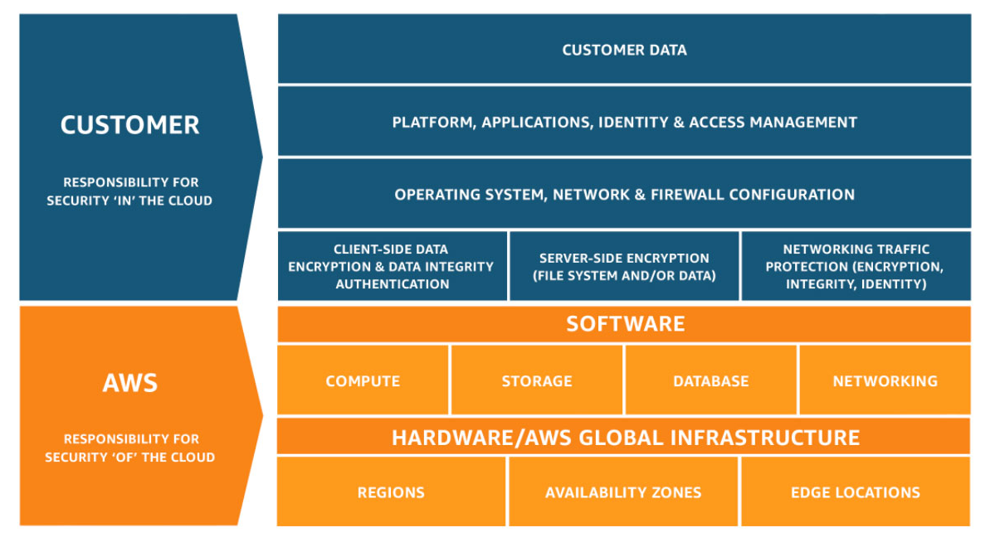

# Security, Compliance, and Governance

***Who*** can access your AWS resources or applications? And ***What*** can they do?

**Security** section in the **Well-Architected Framework**.

1. Identity and Access Management
1. Data Stewardship and Encryption
1. Network Security
1. Application Security
1. Compliance
1. Security Management

## Shared Responsibility Model

### Customer

Responsibility for security '***in***' the cloud: the resources you provision, user access, and customer access tp those resources and applications.

1. **Application Data**: managing application data, includes encryption options. 
1. **Patching**: responsible for the guest operating system (OS), which includes updates and security patches. 
1. **Security Configuration**: Securing account and API calls, rotating credentials, restricting internet access from VPC, and more. 
1. **Identity and Access**: responsible for application security and identity and access management. 
1. **Network Traffic**: Responsible for network traffic protection, which includes security group firewall configuration. 
1. **Installed Software**: responsible for application code, installed software, and more. Should frequently scan for and patch vulnerabilities in code base. 

### AWS

Responsibility for security '***of***' the cloud: the security of data centers and all of the software and interconnections that define the AWS Cloud.

1. Secure the hardware and the underlying software the your cloud resources run on.
1. Responsible for its global infrastructure elements: Regions, edge locations, and Availability Zones. 
1. Controls access to its data centers where you data resides. 
1. Maintains networking components: generators, uninterruptible power supply (UPS) systems, computer room air condition (CRAC) units, fire suppression systems, and more. 
1. Responsible for any managed service like RDS, S3, ECS, or Lambda, patching of host operating systems, and data access endpoints. 

### Managed Services

Offload some customer responsibility to AWs by leveraging **Managed Services**.

Example: Host database on **EC2** vs on **RDS**. On EC2, the user is responsible for OS security and patches; while on **RDS**, AWS will offload that responsibility.

## Principle of LEast Privilege

The **Principle of Least PRivilege** states you should grant only permissions needed to completed a task;  giving a user the minimum access required to get the job done. 

## Identity and Access Management

1. The **Root User** is the user who can create your user accounts and the only user that can destroy your AWS account.
1. Secure all users with **Multi-Factor Authentication** (MFA). 
1. **IAM** can be used to enforce **MFA**. **IAM** can also be used to define granular permissions.
1. **IAM** can be applied to individual **IAM** users, or **User Groups**.
1. By default, an **IAM** user does not have access to any resources, or actions on your AWS accounts. Only by creating an IAM policy and attaching it to that user, can they then access the specific resources listed in the **IAM** policy.
1. **IAM Policies** can attached to **IAM Role**. **IAM Role** access keys automatically rotate by design.

### Additional IAM Tools 

**IAM Access Analyzer**: identity resources with external access, validate **IAM Policies**, and generate **IAM Policies** based on usage.

**IAM Policy Simulator**: test new **IAM Policies** before granting them to users, user groups and roles.

## Leveraging Existing Identity Providers

Single Sign On function in **IAM**.

### Federated Identities

Using **Roles**.

**IAM Identity Center** allows AWS users to leverage Single Sign-On to temporarily assume a role each time they log in.

It can connect to an existing Microsoft authenticated directory. It does not happen automatically, need to utilize **AWS Directory Service**.

Use **IAM Identity Center** to give human user permissions over **IAM**.

### Web Federated Identities

**Amazon Cognito** creates use pools and grant temporary keys to customers to give access to your application. Leverage social or enterprise identity providers for authentication.

### AWS Security Token Service (STS)

**STS** grants individual users temporary access, which will allow them to assume a temporary role. 

Use **STS** for temporary access patterns, like read-only access for a third-party audit.

## Keeping Secrets Safe

### Key Management Service (KMS) 

**KMS** allows to generate and store encryption keys. 

1. Key generator. 
1. Store and control Keys. 
1. AWS manages encryption keys. 
1. Automatically enabled for certain services. 

Create an encrypted Amazon EBS volume, you're able to specify a **KMS** customer master key. 

### Encryption in Transit

Encryption data that travels from service to service, or to applications over the web.

1. All traffic within an Amazon **VPC** is encrypted by default.
1. Use HTTPS protocol. HTTPS encrypts your data in transit using Transport Layer Security (TLS) protocol. 
1. **Certificate Manager** is services to provision, deploy, and automatically renew public or private SSL/TLS certificates.

### Encryption At Rest

**Encryption at rest** means protecting your data in place.

1. **S3** is encrypted by default using Server Side D3 managed keys upon creation.
1. **Amazon Macie**[[definition](#aws-macie)] uses machine learning to scan your buckets and find sensitive information, such as personally identifiable information; and help you make sure that it doesn't get exposed.
1. **Elastic Block Store** (EBS) is the storage for most EC2 instances. To encrypt an EBS volume, use a key from **Key Management Service** (KMS)
1. **Key Management Service** can also be used to encryption **RDS** database instances. If your RDS database is not encrypted, you have to create a copy of it and encrypt that copy upon creation.

### Systems Manager Parameter Store

**Systems Manager Parameter Store** is a server that keeps secret parameters (like usernames, passwords, database strings, and other values for reference), and gives programmatic access to resources on AWS.

### Secrets Manager

**Secret Manager** adds another layers of security by enabling Automatic rotation of your secrets.

## Exploring Network Security Services

From [Networking](Networking.md), **Network Access Control Lists** (NACLs) provide stateless access control in VPCs and subnets. Rules stop all traffic which do not meet the particular filter set by **NACLs** due to the characteristics of stateless.

Also from [Networking](Networking.md), **Security Groups** provide stateful access control for particular resources. External resources can only reach your resources if they pass through the filter of the security group, but if the connection is initiated from within the subnet or within the **Security Group**, the **Security Group** will allow the response.

### AWS Network Firewall

**Network firewall** not only filters based on origin, but can also define complex rules to inspect traffic within VPCs.

### AWS Wab Application Firewall (WAF)

1. **WAF** allows to protect against all kinds of attacks on your public AWS Endpoints
1. **WAF** protects web applications from common exploits.
   1. Protects apps against common attack patterns 
   1. Protects against SQL injection 
   1. Protects against cross-site scripting. 

Standing in front of CloudFront and Application load balancer.

### AWS Shield

A managed Distributed Denial of Services (DDoS) protection service. 

1. Always-on detection 
1. Shield Standard is free 
1. Shield Advanced is a paid services. It provides expanded protection, and access to a ***24/7 DDoS response team***.

Works with CloudFront, Route 53, Elastic Load Balancing , and AWS Global Accelerator.

### AWS Firewall Managers

**AWS Firewall Manager** helps you administer your network security from a single service. It sends findings on unprotected resources or alerts you when a suspected DDoS attack is under way.

## Security Hub

**Security Hub** is a central service where you receive security findings from across your AWS security services, and it prioritizes actionable advise how to address these findings. It includes **Firewall Manager**, **GuardDuty**, **Inspector**, **Macie**, **Systems Manager**, **Config**, **IAM Access Analyzer**, and **AWS Health** in a single service.

**Security Hub** prioritize security events by aggregating findings from many security services.

### GuardDuty

An intelligent threat detection system that uncovers unauthorized behavior. Listen to network traffic. It tracks activity logs across your AWS account, sends finding in response to malicious behavior.

**GuardDuty**'s Anomaly detection feature evaluates all API requests in your account and identifies events that are associated with common techniques used by attackers. 

1. Uses machine learning. 
1. Built-in detection for EC2, S3, and IAM. 
1. Reviews CloudTrail, VPC Flow Logs, and DNS logs. 

### Inspector 

**Inspector** inspects your workloads for vulnerabilities and network access, sends it findings to Security Hub.

**Inspector** has several built-in rules to access your EC2 instances to find vulnerabilities and report them prioritized by level of severity. 

1. Works with EC2 instances, Lambda functions, container images in Amazon ECR, and within various CI/CD tools to uncover and report vulnerabilities. Install Agents. 
1. Reports vulnerabilities found. 
1. Checks access from the internet, remote root login, vulnerable software versions, etc.. 

### Macie

**Macie**, mentioned in searches your **S3 Buckets** for sensitive information including PII and sends its finding to **Security Hub**.

### Systems Manager

**System Manager** produces findings about noncompliant resources and sends findings to **Security Hub**.

### Config

**Config** allows to assess, audit, and evaluate the configurations of resources. It uses **detective guardrails** to find noncompliant resources and sends findings to **Security Hub**.

Notifications via **Simple Notification Services** (SNS) or every configuration change. 

1. Track configuration changes over time. 
1. Delivers configuration history file to S3. 

### IAM Access Analyzer

**IAM Access Analyzer** [[definition](#iam-access-analyzer)] detects externally accessible resources or unused access and reports findings to **Security Hub**.

### AWS Health

**AWS Health** reports ***service outages*** relevant to your AWS resources and sends findings to **Security Hub**.

## Responding to Security Events.

| Four Horsemen of Security Confusion | |
|--- |--- |
| AWS Trusted Advisor | Provides best practice advice |
| Amazon GuardDuty | Detects active threats |
| Amazon Detective | Investigates security events |
| Amazon Inspector | Detects workload vulnerabilities |

### AWS Trusted Advisor

Provides real-time guidance to help you provision your resources following AWS best practices. 

1. Checks your account and makes recommendations. 
1. Helps you see service limits. 
1. Provides best practices advises. 

Recommendations: 

1. Checks for unrestricted access for specific ports on EC2 instances (free check). 
1. Checks S3 bucket permissions to determine if public access (free check). 
1. Checks for multi-factor authentication (MFA) on root account (free check). 
1. Checks IAM password policy (enterprise or business support required). 
1. Checks for RDS public snapshots (free check). 
1. Checks for service usage greater than 80% over service limit (enterprise or business support required). 
1. Checks for exposed access keys (enterprise or business support required). 

Checks for CloudFront content delivery optimization (enterprise or business support). 

### Amazon GuardDuty

For more information, revisit [[Security Hub](#security-hub)]. **Amazon GuardDuty** collects activity logs from around AWS and ses machine learning to intelligently detect threats.

### Amazon Detective

**Amazon Detective** is used for investigating security events that have already happened. Untangling the mystery of a security event on AWS can be really complicated. There are a bunch of logs where a bunch of different agents are taking actions across your AWS environment. If you've discovered that a security event has taken place, you can use **Amazon Detective** to help you figure out the extent of the damage that may have occurred.

### Amazon Inspector

For more information, revisit [[Security Hub](#security-hub)]. **Amazon Inspector** for software vulnerabilities and network exposure.

## Governing Multiple Accounts on AWS

In AWS, an account is a collection of resources which many users can log into and contribute to.

Organizations have many accounts and resources separated logically based on who need to access them. These accounts can be managed centrally from a management account.

### AWS Organizations

**AWS Organizations** administer multiple AWS accounts from a single point, consolidating cost while organizing and limiting access to resources. Even though resources will be in separate accounts, you can enable consolidated billing and your organization will be billed as though as a single account.

1. Group multiple accounts. 
1. Single payment for all accounts. 
1. Automate account creation. 
1. Allocate resources and apply policies across accounts. 
1. Consolidate billing.

Organization units (OUs) are a groping of AWS accounts that are similar. 

Use **Config** rules detect noncompliant resources across the entire organization. Apply rules at the organization level, while all children accounts inherit these config rules, and monitor them from the management account.

Use **Service Control Policies** to prevent actions across the entire organization. It enforce permissions you want everyone in the organization to follow. 

Plays well with **Security Hub**, receives findings across many accounts.

Organization Service Control Policies (SCPs) allow you to create permissions guardrails that apply to all accounts within a give organization.

#### AWS Control Tower

**AWS Control Tower** automates account creation and the application of best-practice **Config** rules and **SCPs**.

## Compliance on AWS

AWS supports over 140 different Standards and compliance certifications. But it does not mean the customer solutions do.

Security and compliance is a shared responsibility, but demonstrating compliance in the cloud is ultimately the customer's responsibility.

### AWS Artifact

**Artifact** enables you to download security and compliance documents to share with regulators or inform architectural decisions.

### Audit Manager

Automate assessments against framework designed to meet common compliance standards.

### Security Token Service [[definition](#security-token-service)]

AWS STS enables you to request temporary credentials for users such as auditors

Not all services are in scope for all compliance programs.

Examples: FIPS 140-2 level 3 cannot use **KMS**, but **CloudHSM**. Within HIPAA compliance, when moving data from on-premise to the cloud, cannot use transporting data over public internet; instead using **Snowball Edge**.

---

[[Back to Table of Content](README.md)]
