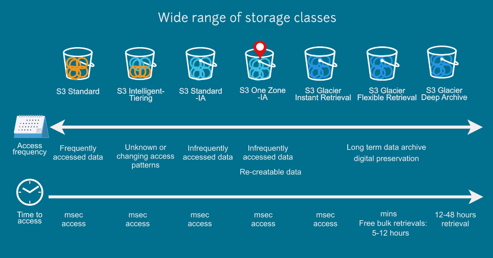

# Storage

## Amazon Simple Storage Service (S3)

Amazon S3 works with AWS Lambda, you can log activities, define alerts and automate workflows without managing additional infrastructure.

### Wide range of storage classes

1. S3 Standard
1. S3 Intelligent-Tiering
1. S3 Standard-IA
1. S3 One Zone-IA
1. S3 Glacier Instant Retrieval
1. S3 Glacier Flexible Retrieval
1. S3 Glacier Deep Archive

### S3 Lifecycle Policy

**S3 Lifecycle Policy** defines when objects transition to another storage class and when objects expire.

### S3 Storage Class Analysis

Use **S3 Storage Class Analysis** to discover data that should move to a lower cost storage class based on access patterns. Use the data from the analysis to configure an **S3 Lifecycle policy** that makes the data transfer.

### S3 Object Lock

Objects are locked for the duration of the retention period that you define and are protected from deletion.